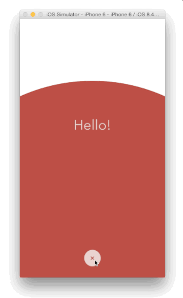

# iOSAnimationExamples

🎬 A curated collection of practical iOS animation examples, covering **UIViewPropertyAnimator**, **Core Animation**, **UIKit Dynamics**, and **custom transitions**. Designed for learning, reference, and real-world reuse.

---

## 📂 Structure

- `/Basic/` – Simple implicit/explicit animations with `UIView` and `CALayer`
- `/Advanced/` – Custom `UIViewController` transitions, keyframe animations
- `/Interaction/` – Gesture-driven animations, interactive transitions
- `/Physics/` – UIKit Dynamics, spring and decay effects
- `/SwiftUI/` – SwiftUI-based animation demos (if applicable)

---

### 🚁Transition (转场)



🖥️[BubbleTransition git](https://github.com/andreamazz/BubbleTransition)

实现方式简介:   使用 mask + CAShapeLayer + UIBezierPath 方法实现

## 🚀 Quick Start

```bash

```